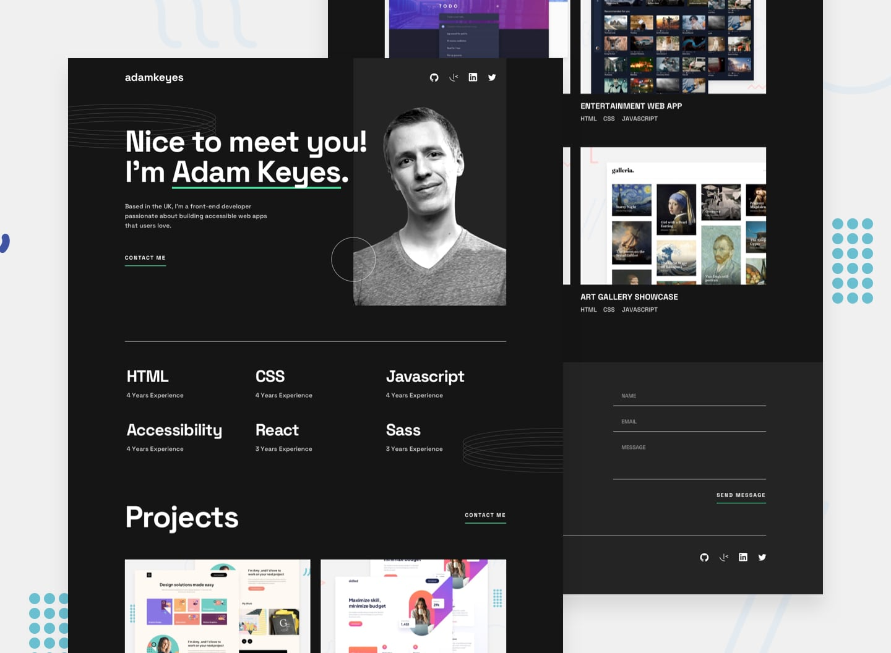

# Single-page developer portfolio solution

## Table of contents

- [Overview](#overview)
  - [The challenge](#the-challenge)
  - [Screenshot](#screenshot)
  - [Links](#links)
- [Built with](#built-with)
- [Author](#author)

## Overview

### The challenge

Users should be able to:

- Receive an error message when the `form` is submitted if:
  - Any field is empty
  - The email address is not formatted correctly
- View the optimal layout for the interface depending on their device's screen size
- See hover and focus states for all interactive elements on the page

### Screenshot

### Links

- Solution URL: [Frontend Mentor](https://your-solution-url.com)
- Live Site URL: [GH-Pages](https://github.com/ThomasLawlor17/dev-portfolio)

## Built with

- Semantic HTML5 markup
- CSS custom properties
- Flexbox
- CSS Grid
- Mobile-first workflow
- [React](https://reactjs.org/) - Typescript
- [Styled Components](https://styled-components.com/) - For styles

## Author

- Website - [Thomaslawlor.com](https://thomaslawlor.com/)
- Frontend Mentor - [@ThomasLawlor17](https://www.frontendmentor.io/profile/ThomasLawlor17)
- Github - [@ThomasLawlor17](https://github.com/ThomasLawlor17)